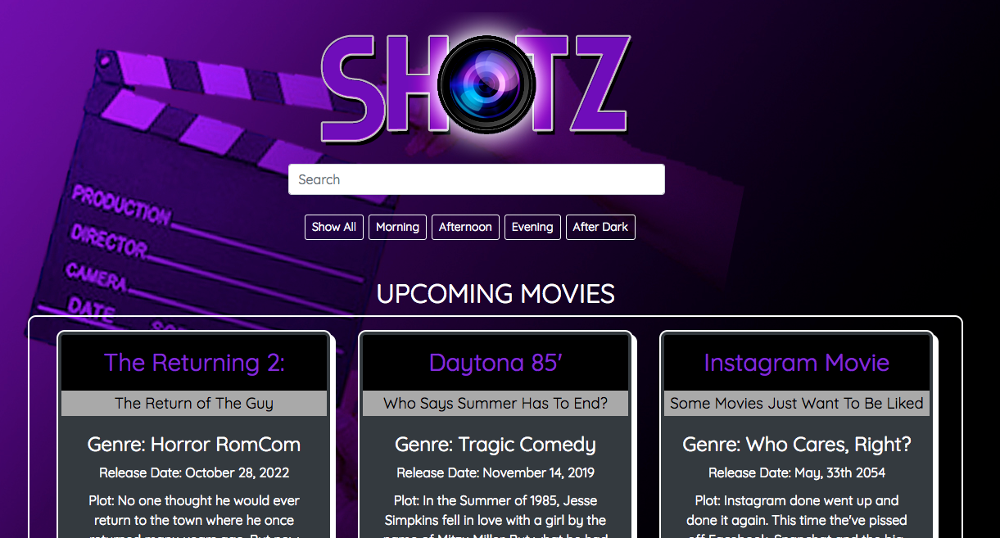

## SHOTZ
* Shotz is a application to where you can track your upcoming movies and shoot locations. You have a search bar and corresponding buttons to help you navigate your way. 

## Technologies Used
* Bootstrap 4
* HTML
* CSS
* Javascript
* Jquery
* Json

## How to Run
1. Go to: `https://www.npmjs.com/package/http-server` and install "http-server".  
2. Navigate to the project folder in command line interface and type: `http-server -p 8080`  
3. This will show at: `http://localhost:8080` in your internet browser. 
